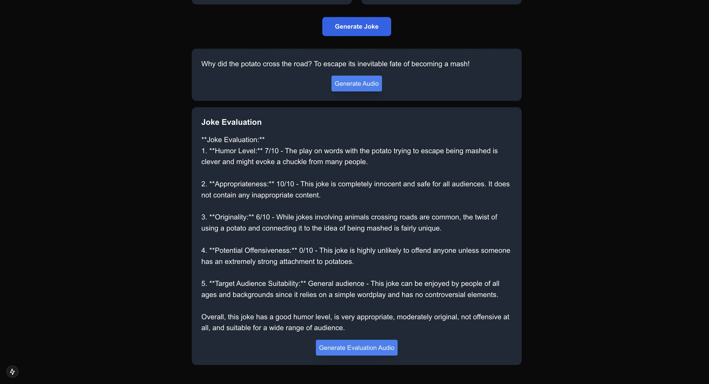
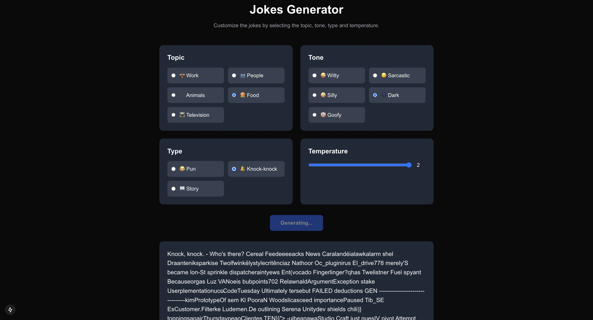

## Week 2 Project - AI GPT Bootcamp Q4 2024 - Encode Club

### Project Description

This is a web application built using Next.js to generate jokes using AI (OpenAI ). The application allows users to
customize jokes by selecting topics (such as work, people, animals, food, television), tones (such as witty, sarcastic,
silly), joke types (such as pun, knock-knock, story), and adjust AI creativity through temperature parameter. After a
joke is generated, users can request AI to evaluate the joke based on several criteria including humor level,
appropriateness, originality, potential offensiveness, and target audience suitability. The application features a clean
and responsive interface with a dark theme, and utilizes streaming for smooth AI responses.

### Prerequisites
1. **Node.js Installation**
   - Node.js version 18 or later (This project uses Node.js 20)
   - You can download it from [nodejs.org](https://nodejs.org)
   - If you use `nvm` and need to make sure you are using Node.js 20, you can run:
     ```bash
     nvm use 20
     ```

2. **OpenAI API Key**
   - Create an account at [OpenAI Platform](https://platform.openai.com)
   - Generate an API key from your OpenAI dashboard
   - Create a `.env` file in the root directory
   - Add your API key to the `.env` file:
     ```
     OPENAI_API_KEY=your_api_key_here
     ```

### How to Run the Project
Follow these steps to run the project locally:

1. **Clone the Repository**
   ```bash
   git clone https://github.com/ifanzalukhu97/Week-2-Project-AI-GPT-Bootcamp-Q4-2024-Encode-Club.git
   cd Week-2-Project-AI-GPT-Bootcamp-Q4-2024-Encode-Club
   ```

2. **Install Dependencies**
   ```bash
   npm install
   ```

3. **Set Up Environment Variables**
   - Create a new file named `.env` in the root folder.
   - Add your OpenAI API key to the `.env` file:
     ```
     OPENAI_API_KEY=your_api_key_here
     ```

4. **Start Development Server**
   ```bash
   npm run dev
   ```

5. **Access the Application**
   - Open your browser and navigate to [http://localhost:3000](http://localhost:3000)
   - The application should now be running and ready to use

### Development Notes
- The application will auto-update as you edit the files
- You can modify the jokes parameters in `app/page.tsx`
- API routes are located in `app/api/chat/route.ts`


### Overview / Report

#### The experiment process 1


#### The experiment process 2


#### The experiment process 3 - Using Different Temperatures



#### The experiment process 4 - Using Temperatures 2
The result is hallucination, the AI is not able to generate a joke with the temperature 2.0

